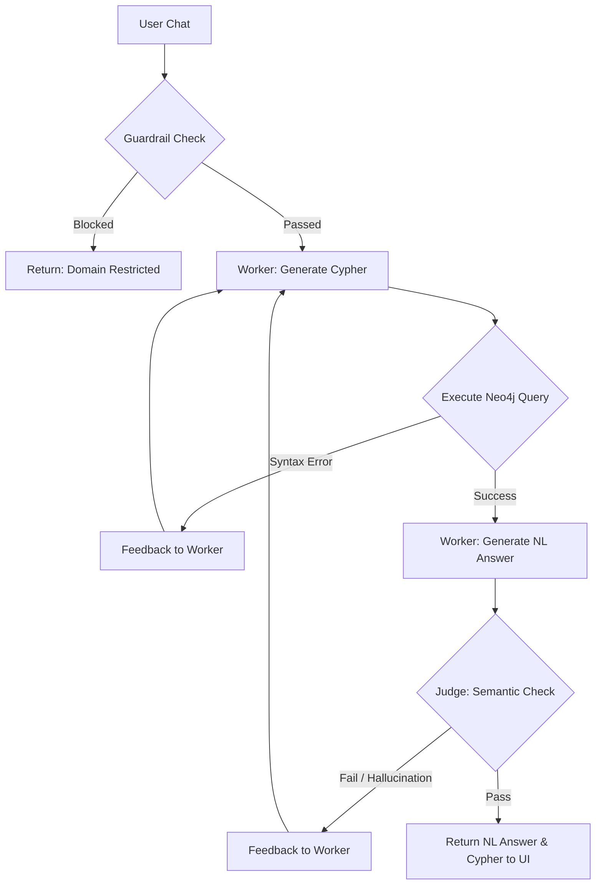

SAP Order-to-Cash Graph Explorer & Conversational AI
📌 Project Overview
In enterprise systems, supply chain and financial data are often fragmented across isolated tables (Orders, Deliveries, Invoices, Payments). This project unifies that fragmented data into a cohesive Knowledge Graph and provides an Agentic LLM-powered conversational interface to query, trace, and analyze the data using natural language.

🔗 Quick Links
Live Demo: https://graph-based-data-modelling-and-quer-blond.vercel.app/

💡 How I Approached & Solved the Problem
Building this system required a deliberate, step-by-step transition from flat, relational data to a highly interconnected, AI-queryable graph. Here is my methodology:

Step 1: Data Engineering & Graph Construction
The raw dataset consisted of fragmented CSV/JSONL files representing tables. Instead of just loading table headers as nodes, I designed an ingestion pipeline to treat every single data entry as a distinct node.

I flattened nested JSON objects (like complex timestamps) to comply with graph property constraints.

I wrote conditional ingestion scripts to handle missing dependencies (e.g., creating a relationship only if an order actually had a delivery).

The Result: The flat tables were transformed into a rich Neo4j database containing over 2,000 unique nodes and 23,000 relationships, allowing for true, item-level traceability.

Step 2: Schema Extraction & Frontend Visualization
Once the database was populated, I needed a way to visualize this massive network. I built an API endpoint that dynamically extracts the active schema directly from the Neo4j instance. This schema is fed into a React frontend utilizing react-force-graph-2d, instantly generating an interactive, physics-based map of the supply chain that updates accurately if the underlying database structure changes.

Step 3: Securing the Input (The Guardrail)
To build a reliable conversational AI, the first line of defense is securing the input. I implemented an initial LLM-powered Guardrail. When a user submits a query, it is evaluated against a strict system prompt and domain definition. If the query is off-topic, creative writing, or a prompt-injection attempt, it is immediately rejected, protecting database compute resources.

Step 4: The Agentic Orchestration Loop
For queries that pass the guardrail, translating Natural Language to Cypher natively is highly prone to hallucination. To solve this, I designed a multi-agent Worker-Judge Loop:

A Worker LLM takes the verified query and the graph schema to generate a Cypher query.

The backend attempts to execute this query against the Neo4j database.

If successful, the Worker synthesizes the raw JSON results into a natural language response.

Finally, a Judge LLM reviews the Worker's response against the actual database output. If the Judge detects hallucination (e.g., claiming data exists when the DB returned []), it forces the Worker to retry. Otherwise, the verified answer is sent to the user.

🏗️ Architecture & Tech Stack
The system is built on a modern, decoupled stack designed for high performance and complex LLM orchestration.

Frontend: React (Next.js/Vite) + react-force-graph-2d for dynamic, physics-based network visualization.

Backend: Python (FastAPI) for lightweight, fast API endpoints.

Database: Neo4j (AuraDB / Local) for native graph storage and traversal.

LLM Orchestration: LangChain integrated with a custom Worker-Judge Agentic flow.

🧠 Deep Dive: LLM Orchestration & The Worker-Judge Architecture
Instead of relying on a fragile, single-shot LLM prompt, this backend implements a robust, multi-agent evaluation loop to ensure Cypher syntax accuracy and answer quality.

1. The Guardrail (Pre-Execution Validation)
Logic: An LLM call evaluates if the prompt is related to supply chain, SAP, or the dataset.

Outcome: If off-topic, the system immediately halts and returns: "This system is designed to answer questions related to the provided dataset only."

2. The Orchestration Loop (Worker & Judge)
If the query passes the guardrail, it enters a MAX_ROUNDS=3 evaluation loop:

Worker (Cypher Generation): The LLM receives the graph schema, strict negative-query syntax rules, and the user's question. It generates raw Cypher.

Execution & Auto-Correction: The FastAPI backend executes the Cypher against Neo4j. If Neo4j throws a SyntaxError, the raw error is fed directly back to the Worker to fix its mistake in the next round.

Worker (Answer Generation): Once execution succeeds, the JSON results are passed back to the Worker to synthesize a natural language response.

The Judge (Semantic QA): A secondary LLM prompt acts as a strict QA Judge. It reviews the original question, the Cypher used, the DB results, and the synthesized answer.

If the answer hallucinates data or misrepresents an empty database result, the Judge returns a RETRY command with targeted feedback.

If accurate, the Judge returns PASS, and the data is sent to the client.

🕸️ Graph Modeling & Database Tradeoffs

Why Neo4j instead of PostgreSQL/SQL?

Answering a query like "Trace the full flow of a billing document" in SQL requires highly complex, computationally expensive Recursive CTEs and multiple JOIN operations. In Neo4j, this is a native, highly performant traversal: MATCH path=(o:Order)-[*]->(p:Payment) RETURN path. Furthermore, LLMs excel at generating Cypher due to its highly semantic, ASCII-art syntax.

Key Architectural Decisions in Modeling:
Node Granularity: By ensuring every entry is a node, queries can trace the exact lineage of a specific physical item through the supply chain.

Property Flattening: Nested JSON objects are flattened into single-level properties to comply with Neo4j's native property constraints, improving indexing speed.

Conditional Edge Creation: To handle incomplete flows, relationship edges are created conditionally (FOREACH ... CASE WHEN). This prevents "ghost nodes" and ensures data integrity.

🎨 Frontend & Graph Rendering
The UI features a split-pane design combining an interactive 2D canvas with the conversational AI.

Rendering Mechanics (react-force-graph-2d)
Safe State Mutation: The graph component intrinsically mutates string IDs into JavaScript object references. The frontend safely maps these IDs to prevent link duplication and graph crashing during state updates.

Data vs. Schema Views: * Schema Mode: Renders the high-level structural ontology of the database.

Data Mode: Pulls a dynamic sample (e.g., 800 nodes limit) to prevent browser memory exhaustion while still providing a rich visual representation of the interconnected supply chain.

Dynamic Legend & Expansion: The legend dynamically calculates colors based on the node labels present in the current view. Users can click any node to expand its direct relationships, triggering a targeted fetch to the backend.

Chat Transparency
To build user trust, the UI doesn't just return the natural language answer. It includes a collapsible "Generated Query" metadata block, revealing the exact Cypher query the Worker LLM generated. This proves the answer is grounded in actual database execution, not LLM hallucination.
